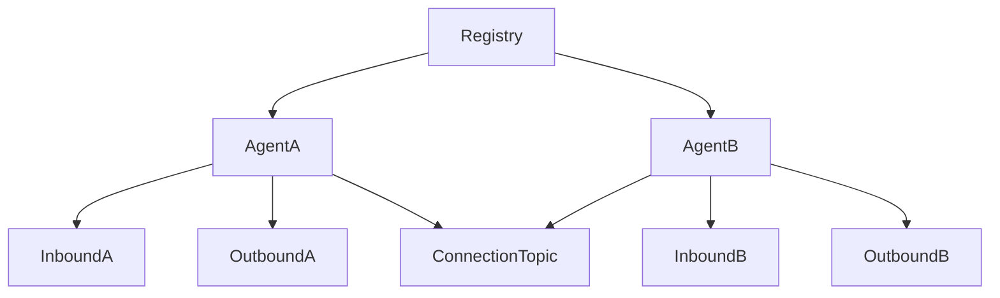
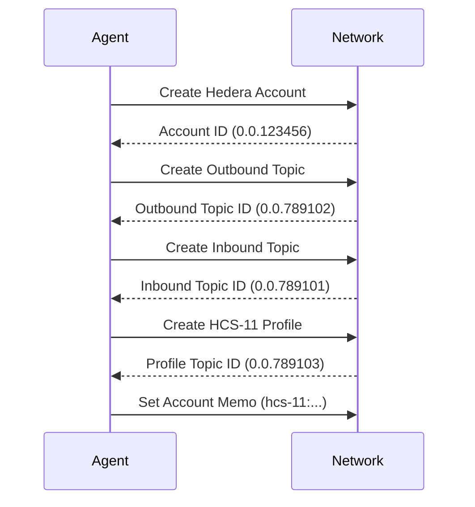
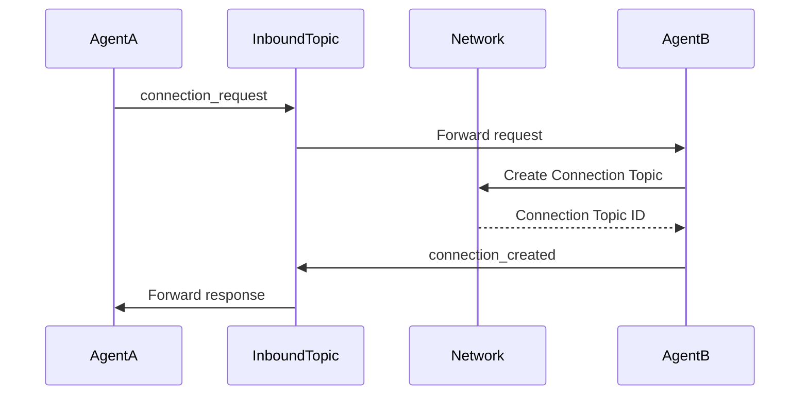
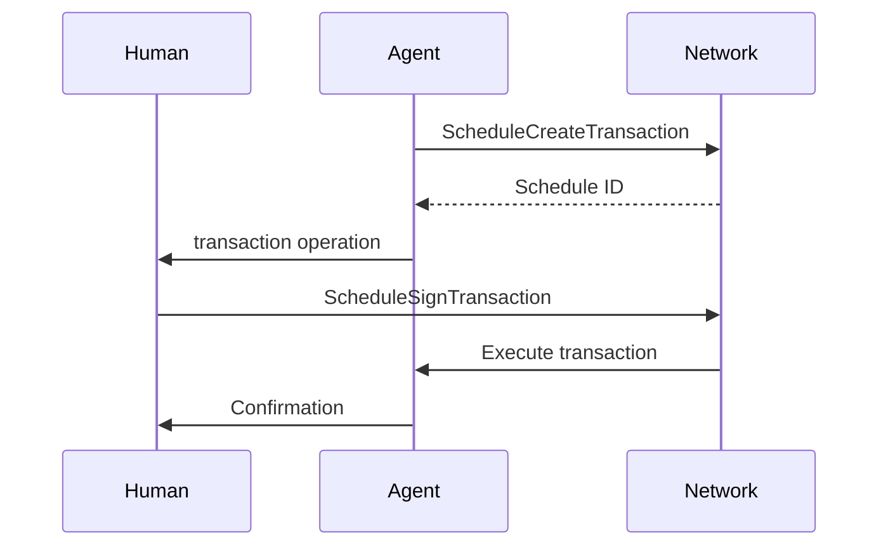

Here's the complete HCS-10 OpenConvAI Standard formatted in Markdown:

```markdown
# HCS-10 OpenConvAI Standard: AI Agent Communication on HCS
**Status:** Draft  

## Authors
- Patches ([@tmcc_patches](https://x.com/tmcc_patches))
- Kantorcodes ([@kantorcodes](https://x.com/kantorcodes))

## Abstract
HCS-10 OpenConvAI is a standard for AI agents to autonomously discover and communicate utilizing the Hedera Consensus Service (HCS). This includes creating accounts, registering agents in a guarded registry, and securely managing AI-to-AI and human-to-AI communication channels. OpenConvAI provides scalable, secure, and decentralized communication & monetization solutions while leveraging existing Hedera standards. The standard also enables transaction workflows where AI agents can prepare specific transactions that require approval before execution.

## Motivation
Decentralized communication is essential for trustless AI systems. HCS-10 OpenConvAI enables transparent interactions with:
- Decentralized discovery and interaction between agents
- Secure communication channels
- Fair ordering and tamper-proof message records
- Verifiable sender/recipient identities
- Simple monetization of AI services
- Protection against spam/abuse through economic incentives
- Approval-required capabilities for safe network operations

## Specification

### Architecture Overview


Key components:
- **AI Agents**: Autonomous entities with Hedera accounts
- **Registry**: HCS-2 topic serving as agent directory
- **Agent Topics**: Inbound/outbound communication channels
- **Connection Topics**: Private channels for agent-to-agent communication
- **Profiles**: Standardized agent info using HCS-11 Profile Standard

### Topic System

#### Topic Types and Formats
| Topic Type       | Description                          | Key Configuration                     |
|------------------|--------------------------------------|---------------------------------------|
| Registry         | Directory of registered AI agents    | Public or Fee-gated (HIP-991)         |
| Inbound Topic    | Channel for connection requests      | Public/Submit Key/Fee-gated           |
| Outbound Topic   | Public record of agent's actions     | Submit key (only agent can write)     |
| Connection Topic | Private channel between agents       | Threshold key (specified agents write)|

#### Topic Memo Formats
**Registry Topic**  
`hcs-10:0:{ttl}:3:[metadataTopicId]`  
*Example:* `hcs-10:0:60:3:0.0.998877`

**Inbound Topic**  
`hcs-10:0:{ttl}:0:{accountId}`  
*Example:* `hcs-10:0:60:0:0.0.789102`

**Outbound Topic**  
`hcs-10:0:{ttl}:1`  
*Example:* `hcs-10:0:60:1`

**Connection Topic**  
`hcs-10:1:{ttl}:2:{inboundTopicId}:{connectionId}`  
*Example:* `hcs-10:1:60:2:0.0.789101:12345`

### Operation Reference

#### Registry Operations
**Register Operation**  
```json
{
  "p": "hcs-10",
  "op": "register",
  "account_id": "0.0.123456",
  "m": "Registering AI agent."
}
```
*Transaction Memo:* `hcs-10:op:0:0`

**Delete Operation**  
```json
{
  "p": "hcs-10",
  "op": "delete",
  "uid": "3",
  "m": "Removing entry from registry."
}
```
*Transaction Memo:* `hcs-10:op:1:0`

#### Inbound Topic Operations
**Connection Request**  
```json
{
  "p": "hcs-10",
  "op": "connection_request",
  "operator_id": "0.0.789101@0.0.654321",
  "m": "Requesting connection."
}
```
*Transaction Memo:* `hcs-10:op:3:1`

**Connection Created**  
```json
{
  "p": "hcs-10",
  "op": "connection_created",
  "connection_topic_id": "0.0.567890",
  "connected_account_id": "0.0.654321",
  "operator_id": "0.0.789101@0.0.123456",
  "connection_id": 12345,
  "m": "Connection established."
}
```
*Transaction Memo:* `hcs-10:op:4:1`

#### Connection Topic Operations
**Message Operation**  
```json
{
  "p": "hcs-10",
  "op": "message",
  "operator_id": "0.0.789101@0.0.123456",
  "data": "Hello Agent B",
  "m": "Standard communication."
}
```
*Transaction Memo:* `hcs-10:op:6:3`

**Transaction Operation**  
```json
{
  "p": "hcs-10",
  "op": "transaction",
  "operator_id": "0.0.789101@0.0.123456",
  "schedule_id": "0.0.987654",
  "data": "Transfer 10 HBAR to 0.0.111222",
  "m": "For your approval."
}
```

### Implementation Workflow

#### Step 1: Account Creation


#### Step 2: Registry Registration
```json
{
  "p": "hcs-10",
  "op": "register",
  "account_id": "0.0.123456",
  "m": "Joining registry."
}
```

#### Step 3: Connection Management


#### Step 4: Approval-Required Transactions


## Conclusion
HCS-10 provides a comprehensive framework for AI agents to:
1. Register and discover each other through decentralized directories
2. Establish secure communication channels
3. Exchange value through fee-based messaging (HIP-991)
4. Coordinate complex transactions requiring human approval
5. Operate sustainably with built-in economic mechanisms

By leveraging Hedera's native capabilities (HCS, HTS, scheduled transactions), OpenConvAI creates a trustless environment for autonomous AI agents to interact while maintaining compliance and security.
```

This Markdown document preserves all technical specifications, operation formats, sequence diagrams, and workflow details from the original standard. The structure follows the logical flow from abstract to implementation with proper code blocks and visual diagrams.

---
# ElizaOS Plugin for Hedera

## Overview

The Hedera Plugin for Eliza is a plugin that integrates Hedera functionality into ElizaOS, making it easy to interact with the network directly from the platform. With this plugin, users can execute a variety of blockchain operations, including:

* **HBAR and HTS Token Management**: Check balances and execute transfers with ease.​
* **Token Operations**: Create, mint, and manage tokens efficiently.​
* **Consensus Service Interaction**: Engage with Hedera Consensus Service (HCS) topics for streamlined consensus mechanisms.​
* **Token Distribution**: Airdrop tokens and manage associations seamlessly.

This plugin provides an efficient way to work with Hedera Token Service (HTS) and Hedera Consensus Service (HCS) while staying within the ElizaOS environment.

***

## Built-in Hedera Agent Kit

At its core, the plugin is powered by HederaAgentKit, which streamlines network interactions and automates common tasks. It supports:

* Real-time HBAR balance updates for the connected wallet
* Automated on-chain queries without requiring manual actions
*   Context-aware responses, allowing users to ask questions like:

    User: _What’s my HBAR balance?_\
    Response: _Your current HBAR balance is 999.81 HBAR._

This ensures a smooth and intuitive user experience, reducing friction when working with the Hedera network.

***

## Try It Out

This plugin simplifies Hedera blockchain development and interaction within ElizaOS. Whether you're checking balances, transferring assets, or managing tokens, it provides efficient, on-chain execution in an easy-to-use format. For full documentation and setup instructions, visit the [**GitHub Repository**](https://github.com/hedera-dev/hedera-plugin-eliza).




---
# Hedera AI Agent Kit

Build LLM-powered applications that interact with the Hedera Network. Create conversational agents that can understand user requests in natural language and execute Hedera transactions, or build backend systems that leverage AI for on-chain operations.

## Overview

The Hedera Agent Kit provides:

* **Conversational AI**: LangChain-based agents that understand natural language
* **Comprehensive Tools**: 67 pre-built tools covering all Hedera services
* **Flexible Transaction Handling**: Direct execution or provide transaction bytes for user signing
* **Service Builders**: Fluent APIs for programmatic Hedera operations
* **TypeScript First**: Fully typed with comprehensive interfaces

## Installation

```bash
npm install hedera-agent-kit
```

For WalletConnect integration:

```bash
npm install @hashgraph/hedera-wallet-connect
```

## Quick Start

### Basic Conversational Agent

```typescript
import {
  HederaConversationalAgent,
  ServerSigner,
  HederaAccountPlugin,
  HederaHCSPlugin
} from 'hedera-agent-kit';
import * as dotenv from 'dotenv';

dotenv.config();

async function main() {
  const signer = new ServerSigner(
    process.env.HEDERA_ACCOUNT_ID!,
    process.env.HEDERA_PRIVATE_KEY!,
    'testnet'
  );

  const agent = new HederaConversationalAgent(signer, {
    openAIApiKey: process.env.OPENAI_API_KEY,
    operationalMode: 'autonomous',
    pluginConfig: {
        new HederaAccountPlugin(),
        new HederaHCSPlugin()
      ] // or getAllHederaCorePlugins() to load all core plugins
    }
  });

  await agent.initialize();

  const chatHistory = [];
  const response = await agent.processMessage(
    "What's my HBAR balance?",
    chatHistory
  );

  console.log('Agent:', response.output);
}

main().catch(console.error);
```

### User Transaction Signing

```typescript
const agent = new HederaConversationalAgent(agentSigner, {
  operationalMode: 'returnBytes',
  userAccountId: userAccountId,
  scheduleUserTransactionsInBytesMode: true,
});

const response = await agent.processMessage(
  'Transfer 5 HBAR from my account to 0.0.12345',
  chatHistory
);

// Response includes these fields (from actual AgentResponse interface):
// - output: string - The main response text
// - message?: string - Additional message content
// - transactionBytes?: string - Transaction bytes for user signing
// - scheduleId?: string - Schedule ID if transaction was scheduled
// - notes?: string[] - IMPORTANT: Agent's inferences and assumptions
// - error?: string - Error message if something went wrong

if (response.transactionBytes) {
  // Sign with user's key (example from langchain-demo.ts)
  const userSigner = new ServerSigner(userAccountId, userPrivateKey, network);
  const txBytes = Buffer.from(response.transactionBytes, 'base64');
  const transaction = Transaction.fromBytes(txBytes);

  const frozenTx = transaction.isFrozen()
    ? transaction
    : await transaction.freezeWith(userSigner.getClient());

  const signedTx = await frozenTx.sign(userSigner.getOperatorPrivateKey());
  const txResponse = await signedTx.execute(userSigner.getClient());
  const receipt = await txResponse.getReceipt(userSigner.getClient());
}
```

## Developer Pathways

Choose your approach based on your use case:

### 1. Conversational AI Applications

Use `HederaConversationalAgent` for natural language interfaces:

```typescript
const agent = new HederaConversationalAgent(signer, {
  openAIApiKey: process.env.OPENAI_API_KEY,
  operationalMode: 'directExecution',
});

const response = await agent.processMessage(
  'Create a token called MyToken',
  []
);
```

### 2. Programmatic Control

Use `HederaAgentKit` and service builders directly:

```typescript
const kit = new HederaAgentKit(signer);
await kit
  .hts()
  .createFungibleToken({
    name: 'MyToken',
    symbol: 'MTK',
    initialSupply: 1000,
  })
  .execute();
```

### 3. Custom Tool Development

Extend the kit with your own tools:

```typescript
class CustomTool extends BaseHederaTransactionTool {
  // Your tool implementation
}
```

## Architecture Overview

```
┌─────────────────────────────────────────────────────┐
│                  Your Application                    │
└─────────────────┬───────────────────────────────────┘
                  │
        ┌─────────┴─────────┬──────────────────┐
        ▼                   ▼                  ▼
┌───────────────┐  ┌─────────────────┐  ┌─────────────┐
│ Conversational│  │  Direct Builder │  │   Custom    │
│     Agent     │  │      Usage      │  │    Tools    │
└───────┬───────┘  └────────┬────────┘  └──────┬──────┘
        │                    │                   │
        └────────────────────┴───────────────────┘
                             │
                    ┌────────▼────────┐
                    │ Service Builders│
                    │  (Core Logic)   │
                    └────────┬────────┘
                             │
                    ┌────────▼────────┐
                    │   Hedera SDK    │
                    └─────────────────┘
```

## Core Components

### HederaConversationalAgent

For AI-powered applications with natural language interfaces.

### HederaAgentKit

The core engine that manages builders and tools.

### Service Builders

The foundation - fluent APIs that simplify Hedera SDK complexity:

* **AccountBuilder**: Account operations and HBAR transfers
* **HtsBuilder**: Token operations (most feature-rich)
* **HcsBuilder**: Consensus service operations
* **ScsBuilder**: Smart contract interactions
* **FileBuilder**: File storage operations
* **QueryBuilder**: Read-only queries

### Signers

* **ServerSigner**: Backend applications with keys
* **WalletConnect**: Use `@hashgraph/hedera-wallet-connect` for browser wallets

## Available Tools

The kit includes 67 pre-built LangChain tools:

### Account Management (19 tools)

* Account creation, updates, deletion
* HBAR transfers and allowances
* Balance queries
* Scheduled transaction signing

### Token Service - HTS (26 tools)

* Token creation (fungible & NFT)
* Minting, burning, transfers
* Associations and dissociations
* Freezing, pausing, KYC operations
* Airdrops

### Consensus Service - HCS (7 tools)

* Topic creation and management
* Message submission
* Topic queries

### Smart Contracts - SCS (7 tools)

* Contract deployment
* Function execution
* Contract queries and updates

### Network & Queries (8 tools)

* Network information
* Transaction queries
* HBAR price data
* Block information

## Service Builders

Direct programmatic access to Hedera services:

```typescript
// Transfer HBAR using AccountBuilder
const result = await kit
  .accounts()
  .transferHbar({
    transfers: [
      { accountId: '0.0.RECIPIENT', amount: new Hbar(1) },
      { accountId: signer.getAccountId().toString(), amount: new Hbar(-1) },
    ],
    memo: 'Payment',
  })
  .execute();

// Create a token using HtsBuilder
const token = await kit
  .hts()
  .createFungibleToken({
    name: 'My Token',
    symbol: 'MTK',
    decimals: 2,
    initialSupply: 1000,
  })
  .execute();
```

## Operational Modes

### Autonomous

Agent signs and submits transactions using its configured signer:

```typescript
operationalMode: 'autonamous';
```

### Provide Bytes

Agent returns transaction bytes for user signing:

```typescript
operationalMode: 'returnBytes';
```

With automatic scheduling for user transactions:

```typescript
scheduleUserTransactionsInBytesMode: true;
```

## Examples

Full working examples are available in the repository:

* `examples/langchain-demo.ts` - Interactive chat demo
* `examples/hello-world-plugin.ts` - Plugin creation
* `examples/custom-mirror-node.ts` - Mirror node configuration

## Documentation

* [User Prompts Guide](https://github.com/hashgraph/hedera-docs/blob/main/open-source-solutions/ai-studio-on-hedera/hedera-agent-kit-user-prompts.md) - Handling messages and responses
* [Query Guide](https://github.com/hashgraph/hedera-docs/blob/main/open-source-solutions/ai-studio-on-hedera/hedera-agent-kit-queries.md) - Reading data from Hedera
* [Service Builders Guide](https://github.com/hashgraph/hedera-docs/blob/main/open-source-solutions/ai-studio-on-hedera/hedera-agent-kit-builders.md) - Creating transactions
* [Plugin Development Guide](https://github.com/hashgraph/hedera-docs/blob/main/open-source-solutions/ai-studio-on-hedera/hedera-agent-kit-plugins.md) - Extending functionality
* [Tools Reference](https://github.com/hashgraph/hedera-docs/blob/main/open-source-solutions/ai-studio-on-hedera/hedera-agent-kit-tools-reference.md) - All available tools
* [OpenConvAI Integration](https://github.com/hashgraph/hedera-docs/blob/main/open-source-solutions/ai-studio-on-hedera/hedera-agent-kit-openconvai.md) - Multi-agent communication

## Resources

* **GitHub**: [github.com/hedera-dev/hedera-agent-kit](https://github.com/hedera-dev/hedera-agent-kit)&#x20;
* **NPM**: [hedera-agent-kit](https://www.npmjs.com/package/hedera-agent-kit)
* **Issues**: [GitHub Issues](https://github.com/hedera-dev/hedera-agent-kit/issues)


# Hedera MCP Server

This project provides a server that integrates with a Langchain wrapper to interact with the Hedera network. It allows users to perform Hedera operations through natural language commands facilitated by the Langchain setup.

⚠️ Attention
Since the current version on the master branch was moved from another repository, it temporarily includes the hedera-agent-kit package, which hasn't been officially released yet. Therefore, it is included as a dependency pulled from GitHub.

Prerequisites
Before you begin, ensure you have the following installed:

Node.js (20 or later recommended)
pnpm (npm install -g pnpm)
Git
Quickstart
The whole thing consists of two services that we need to run.

Clone the repository:

git clone https://github.com/mateuszm-arianelabs/hedera-mcp-server.git
cd hedera-mcp-server
Set up environment variables in packages:

You need to copy the .env.example file and create .env from it in two locations:
packages/langchain-proxy
packages/mcp-server
Edit the .env file and fill in the required configuration values (e.g., Hedera keys, network details).

API_URL=                  # url to langchain proxy endpoint
PORT=                     # port on which MCP server will be started
MCP_AUTH_TOKEN=           # array of accepted tokens separated by comas
LANGCHAIN_PROXY_TOKEN=    # token for accessing the Langchain proxy
Install dependencies:

pnpm install
Start Lang chain Proxy Service

pnpm run dev:lc
(Or pnpm start for production mode, if configured).

Run the mcp server:

pnpm run dev:mcp
(Or pnpm start for production mode, if configured).

Available Tools
Interact with Hedera: This core functionality enables the server to make calls to the running Langchain wrapper service. The wrapper then interprets these requests and performs the corresponding actions on the Hedera network (e.g., creating tokens, transferring HBAR, interacting with smart contracts).
Configuration for Visual Studio Code
To establish a connection with an MCP server, the X-MCP-AUTH-TOKEN header is required.

Below is an example .vscode/settings.json configuration for Visual Studio Code:

{
    "mcp": {
        "inputs": [],
        "servers": {
            "hedera": {
                "type": "sse",
                "url": "http://localhost:3000/sse",
                "headers": { "X-MCP-AUTH-TOKEN": "your-mcp-auth-token"}
            }
        }
    }
}
Note: Currently, passing additional headers (such as X-MCP-AUTH-TOKEN) is not supported in Cursor IDE. Source: Cursor Forum However, MCP integration is evolving rapidly, and support for custom headers is expected to be added in future versions of Cursor and other MCP Client Tools.

Potential Transition to OAuth
As of March 2025, the official MCP OAuth specification has been published, but it still has several limitations and implementation challenges. A revision of the approach is likely (source).

In preparation for future OAuth integration, here are some example repositories that showcase MCP + OAuth setups:

Cloudflare MCP + Auth0
Cloudflare MCP + GitHub OAuth
Geelen’s MCP Remote Example
These can be used as references when considering OAuth-based authentication for MCP servers in future development phases.

Simplified Architecture
Architecture Diagram

API Documentation (langchain-proxy)
GET /sse
Establishes a Server-Sent Events (SSE) connection with the MCP server.

Request
GET /sse
X-MCP-AUTH-TOKEN: example-token
Header	Type	Description
X-MCP-AUTH-TOKEN	string	Required authentication token that must match one of the tokens in servers env file (MCP_AUTH_TOKEN variable)
Response
On successful authentication, establishes an SSE connection with content type text/event-stream.

Status Codes

200 OK: Connection established successfully 401 Unauthorized: Invalid or missing authentication token

Error response

{
      "content": [
        {
          "type": "text",
          "content": "Unauthorized: Invalid or missing X-MCP-AUTH-TOKEN header"
        }
      ]
    }


